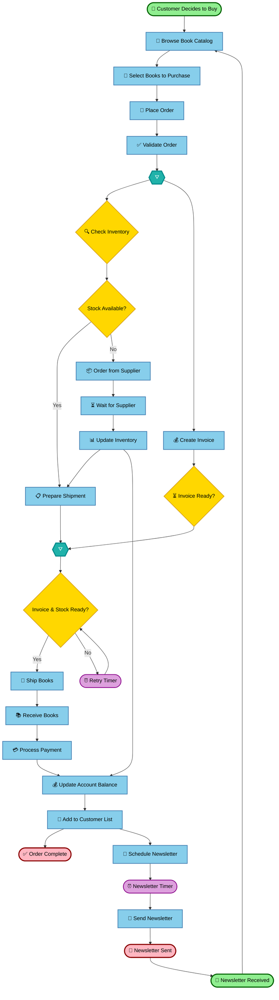

```mermaid
flowchart TD
    %% Start Events
    Start([📅 Customer Decides to Buy])
    NewsletterTrigger([📧 Newsletter Received])
    
    %% Tasks/Activities
    BrowseBooks[📖 Browse Book Catalog]
    SelectBooks[🛒 Select Books to Purchase]
    PlaceOrder[📝 Place Order]
    ValidateOrder[✅ Validate Order]
    CheckInventory{🔍 Check Inventory}
    CreateInvoice[💰 Create Invoice]
    OrderFromSupplier[📦 Order from Supplier]
    WaitForSupplier[⏳ Wait for Supplier]
    UpdateInventory[📊 Update Inventory]
    PrepareShipment[📋 Prepare Shipment]
    WaitForInvoice{⏳ Invoice Ready?}
    ShipBooks[🚚 Ship Books]
    ReceiveBooks[📚 Receive Books]
    ProcessPayment[💳 Process Payment]
    UpdateBalance[💰 Update Account Balance]
    AddToCustomerList[👥 Add to Customer List]
    ScheduleNewsletter[📧 Schedule Newsletter]
    SendNewsletter[📨 Send Newsletter]
    
    %% Gateways
    StockGateway{Stock Available?}
    InvoiceReady{Invoice & Stock Ready?}
    
    %% End Events
    OrderComplete([✅ Order Complete])
    NewsletterSent([📧 Newsletter Sent])
    
    %% Parallel Gateway
    ParallelStart{{ ⛛ }}
    ParallelEnd{{ ⛛ }}
    
    %% Timer Events
    NewsletterTimer([⏰ Newsletter Timer])
    RetryTimer([⏰ Retry Timer])
    
    %% Main Flow
    Start --> BrowseBooks
    BrowseBooks --> SelectBooks
    SelectBooks --> PlaceOrder
    PlaceOrder --> ValidateOrder
    ValidateOrder --> ParallelStart
    
    %% Parallel Processing
    ParallelStart --> CheckInventory
    ParallelStart --> CreateInvoice
    
    %% Inventory Branch
    CheckInventory --> StockGateway
    StockGateway -->|Yes| PrepareShipment
    StockGateway -->|No| OrderFromSupplier
    OrderFromSupplier --> WaitForSupplier
    WaitForSupplier --> UpdateInventory
    UpdateInventory --> PrepareShipment
    
    %% Invoice Branch
    CreateInvoice --> WaitForInvoice
    
    %% Convergence
    PrepareShipment --> ParallelEnd
    WaitForInvoice --> ParallelEnd
    ParallelEnd --> InvoiceReady
    InvoiceReady -->|Yes| ShipBooks
    InvoiceReady -->|No| RetryTimer
    RetryTimer --> InvoiceReady
    
    %% Customer Receipt and Payment
    ShipBooks --> ReceiveBooks
    ReceiveBooks --> ProcessPayment
    ProcessPayment --> UpdateBalance
    UpdateBalance --> AddToCustomerList
    AddToCustomerList --> OrderComplete
    
    %% Marketing Subprocess
    AddToCustomerList --> ScheduleNewsletter
    ScheduleNewsletter --> NewsletterTimer
    NewsletterTimer --> SendNewsletter
    SendNewsletter --> NewsletterSent
    
    %% Newsletter Trigger Loop
    NewsletterSent --> NewsletterTrigger
    NewsletterTrigger --> BrowseBooks
    
    %% Supplier Payment (Parallel)
    UpdateInventory --> UpdateBalance
    
    %% Styling for BPMN-like appearance
    classDef startEvent fill:#90EE90,stroke:#006400,stroke-width:3px,color:#000
    classDef endEvent fill:#FFB6C1,stroke:#8B0000,stroke-width:3px,color:#000
    classDef task fill:#87CEEB,stroke:#4682B4,stroke-width:2px,color:#000
    classDef gateway fill:#FFD700,stroke:#DAA520,stroke-width:2px,color:#000
    classDef timerEvent fill:#DDA0DD,stroke:#8B008B,stroke-width:2px,color:#000
    classDef parallel fill:#20B2AA,stroke:#008B8B,stroke-width:3px,color:#fff
    
    class Start,NewsletterTrigger startEvent
    class OrderComplete,NewsletterSent endEvent
    class BrowseBooks,SelectBooks,PlaceOrder,ValidateOrder,CreateInvoice,OrderFromSupplier,WaitForSupplier,UpdateInventory,PrepareShipment,ShipBooks,ReceiveBooks,ProcessPayment,UpdateBalance,AddToCustomerList,ScheduleNewsletter,SendNewsletter task
    class CheckInventory,StockGateway,WaitForInvoice,InvoiceReady gateway
    class NewsletterTimer,RetryTimer timerEvent
    class ParallelStart,ParallelEnd parallel
```