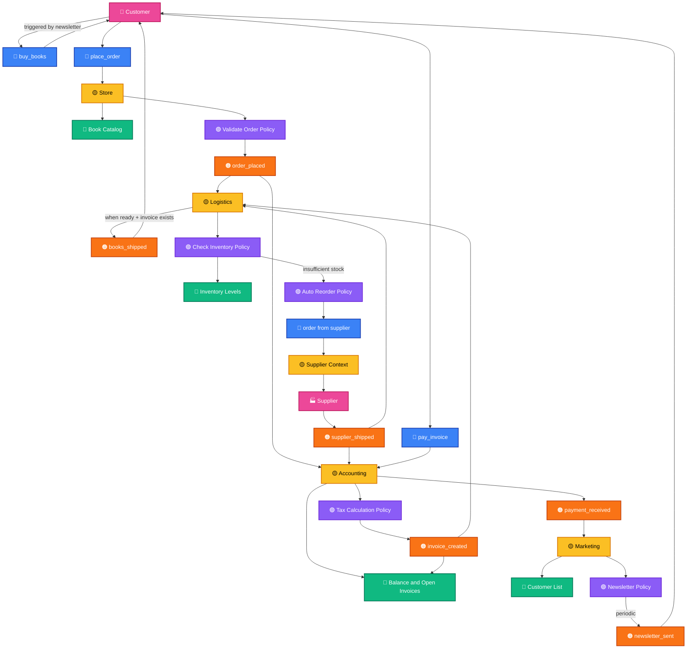

```mermaid
flowchart TB
    %% Actors/Personas
    Customer[👤 Customer]
    Supplier[🏭 Supplier]
    
    %% Commands (Blue)
    BuyBooks[📘 buy_books]
    PlaceOrder[📘 place_order]
    PayInvoice[📘 pay_invoice]
    OrderSupplier[📘 order from supplier]
    
    %% Events (Orange)
    OrderPlaced[🟠 order_placed]
    InvoiceCreated[🟠 invoice_created]
    BooksShipped[🟠 books_shipped]
    PaymentReceived[🟠 payment_received]
    SupplierShipped[🟠 supplier_shipped]
    NewsletterSent[🟠 newsletter_sent]
    
    %% Read Models/Views (Green)
    BookCatalog[📗 Book Catalog]
    Inventory[📗 Inventory Levels]
    BalanceAndInvoices[📗 Balance and Open Invoices]
    CustomerList[📗 Customer List]
    
    %% Aggregates/Bounded Contexts (Yellow)
    Store[🟡 Store]
    Logistics[🟡 Logistics]
    Accounting[🟡 Accounting]
    Marketing[🟡 Marketing]
    SupplierCtx[🟡 Supplier Context]
    
    %% Policies/Business Rules (Purple)
    ValidateOrder[🟣 Validate Order Policy]
    CheckInventory[🟣 Check Inventory Policy]
    AutoReorder[🟣 Auto Reorder Policy]
    TaxCalculation[🟣 Tax Calculation Policy]
    NewsletterPolicy[🟣 Newsletter Policy]
    

    
    %% Flow
    BuyBooks --> Customer
    Customer --> PlaceOrder
    PlaceOrder --> Store
    Store --> BookCatalog
    Store --> ValidateOrder
    ValidateOrder --> OrderPlaced
    
    OrderPlaced --> Logistics
    OrderPlaced --> Accounting
    
    %% Logistics Flow
    Logistics --> CheckInventory
    CheckInventory --> Inventory
    CheckInventory -->|insufficient stock| AutoReorder
    AutoReorder --> OrderSupplier
    OrderSupplier --> SupplierCtx
    SupplierCtx --> Supplier
    Supplier --> SupplierShipped
    SupplierShipped --> Logistics
    SupplierShipped --> Accounting
    
    %% Accounting Flow
    Accounting --> TaxCalculation
    Accounting --> BalanceAndInvoices
    TaxCalculation --> InvoiceCreated
    InvoiceCreated --> BalanceAndInvoices
    InvoiceCreated --> Logistics
    
    %% Shipping Flow
    Logistics -->|when ready + invoice exists| BooksShipped
    BooksShipped --> Customer
    Customer --> PayInvoice
    PayInvoice --> Accounting
    Accounting --> PaymentReceived
    
    %% Marketing Flow
    PaymentReceived --> Marketing
    Marketing --> CustomerList
    Marketing --> NewsletterPolicy
    NewsletterPolicy -->|periodic| NewsletterSent
    NewsletterSent --> Customer
    Customer -->|triggered by newsletter| BuyBooks
    
    %% Styling
    classDef command fill:#3b82f6,stroke:#1e40af,stroke-width:2px,color:#fff
    classDef event fill:#f97316,stroke:#c2410c,stroke-width:2px,color:#fff
    classDef readmodel fill:#10b981,stroke:#047857,stroke-width:2px,color:#fff
    classDef aggregate fill:#fbbf24,stroke:#d97706,stroke-width:2px,color:#000
    classDef policy fill:#8b5cf6,stroke:#6d28d9,stroke-width:2px,color:#fff
    classDef external fill:#6b7280,stroke:#374151,stroke-width:2px,color:#fff
    classDef actor fill:#ec4899,stroke:#be185d,stroke-width:2px,color:#fff
    
    class BuyBooks,PlaceOrder,PayInvoice,OrderSupplier command
    class OrderPlaced,InvoiceCreated,BooksShipped,PaymentReceived,SupplierShipped,NewsletterSent event
    class BookCatalog,Inventory,BalanceAndInvoices,CustomerList readmodel
    class Store,Logistics,Accounting,Marketing,SupplierCtx aggregate
    class ValidateOrder,CheckInventory,AutoReorder,TaxCalculation,NewsletterPolicy policy
    class Customer,Supplier actor
```