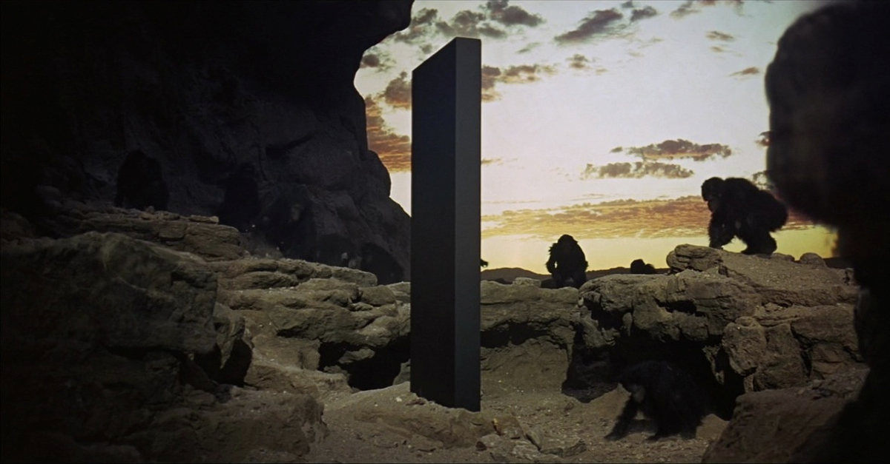

# Evolution of Backend Systems

<!-- 

 -->

## The Monolith

## Portal

**Examples**
- Fiori, OneITSM, IAM, etc

## Microservices (2013)

** Examples **

**Common Mistakes**

- Just build smaller apps (Portal)
- Distributed Monolith
- Isolate Data instead of Functionality
- Share instead of Extract

## Event Driven (2015)

