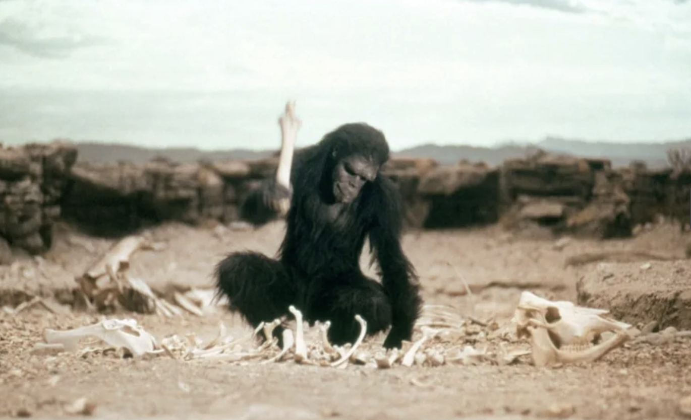
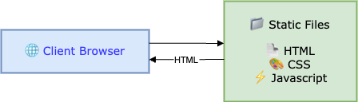
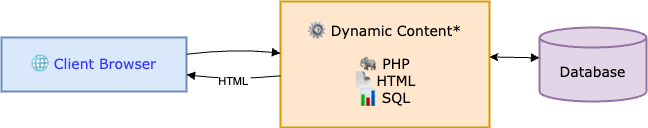
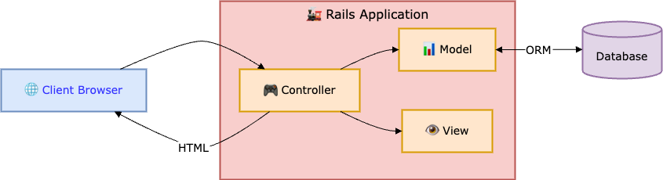
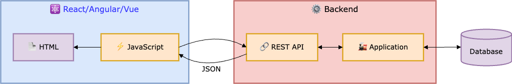
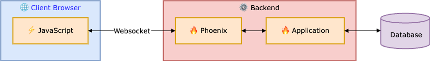

# Evolution of Web Applications

## The early days (1990s)

**Key Characteristics:**
- Simple request-response model
- No server-side processing
- Content same for all users
- Limited interactivity

## The golden Age of PHP (1998)

**Key Characteristics:**
- Server-side scripting
- Database-driven content
- Form processing

## Ruby on Rails (2004)

**Key Characteristics:**
- Convention over configuration
- MVC separation of concerns
- ORM (Object-Relational Mapping)

## Frontend Frameworks (2013)

**Key Characteristics:**
- Client-side rendering
- API-first architecture
- Rich user interactions
- Stateful frontend applications

## LiveView (2018)

**Key Characteristics:**

- Server-side rendered with real-time updates
- WebSocket-based state synchronization 
- Stateful server processes
- Event-driven architecture
- Built-in real-time features

## JAM Stack (2015)

**Key Characteristics:**
- Pre-built markup at build time
- Global CDN distribution
- Serverless architecture
- Decoupled services